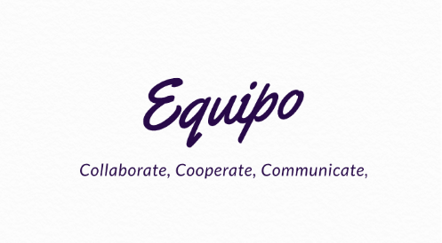

# **Equipo** - Collaborate, Cooperative, Communicate

## Inspiration for Equipo

- Due to unfortunate situation of Covid-19, workspace and atmosphere to an online workspace and uncharted region
- During the competition of **SSDC** (Space Settlement Design Competition), we had to organise ourselves and divide work between 50-60 people and there was a lot of confusion what every person was reposible even after asigning department heads
- With this project we are trying to counter this problem and find a better way for project manager/teacher/employeer to keep a organise and keep a check on his colleages

## What is Equipo

- Equipo is web app which helps a person/manager assign task, manage his empolyees and meet all his/her deadlines **Try Equipo** for all your Projects.

## Potential Uses of Equipo

We feel Uses of Equipo are limitless but we feel these are the situations that this product will be suitable in:-

- Study Groups where People can share thier assignments and stuff
- Project Management for School Projects
- Team Management for bussiness
- Assign Work/Tests to Your Students

## What does Equipo do for an User

- It lets the manager assign task to a person with just a simple click of a button
- It helps a the manager keep track of what his colleages working on and the progress of each task they have assigned to a person
- It also helps the project manager receive work from his colleages and organise it

### Features For an Individual

- It helps you assign your tasks systematically
- It contains a memo pad integrated in the dashboard for storing, downlonding and maintaining notes for each task
- Never miss the on Your task and stay productive through your work hours

### Features For Organisation

- Create Group for Your school projects/Office/random group
- Assign tasks to members in your team/group
- It reminds a member to complete his task on time through **Email**
- Everthing you need at one place

## How we built It

We used the famous python module **Django** to build the backend of the website and we used **Django-allauth** for authentication. We used **Html** ,**CSS** and **JavaScript** to build the website and make it look attractive, responsive and interactive

We divided the work as frontend and backend between our member and made one member to compile the project and finalise the work

## Challenges We ran Into

- There were obviously CSS Bugs like any other project. Also we faced promblem using django like every project

## Accomplishments that we're proud of

- We are happy that we were able to make a really **interactive and attractive website** which contains various features that help will help everyone
- We hope to ease the life of managers and attain full productivity of their team

## Built With

- css
- django
- django-allauth
- html5
- javascript
- python
- Bootstrap

# [Try out our Website]()
